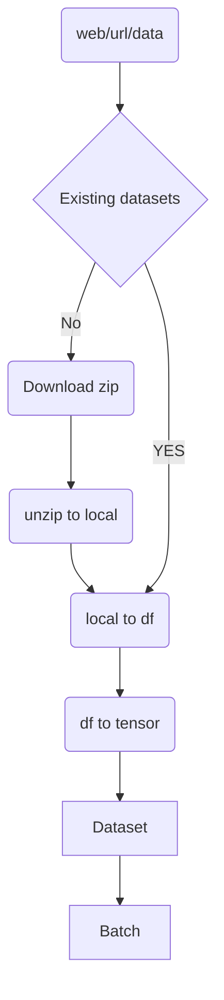

#  WIP
##  Neural collaborative Filter in pytorch
##### https://github.com/NVIDIA/DeepLearningExamples/tree/master/TensorFlow/Recommendation/NCF

### application schema on mermaid Data transformation

